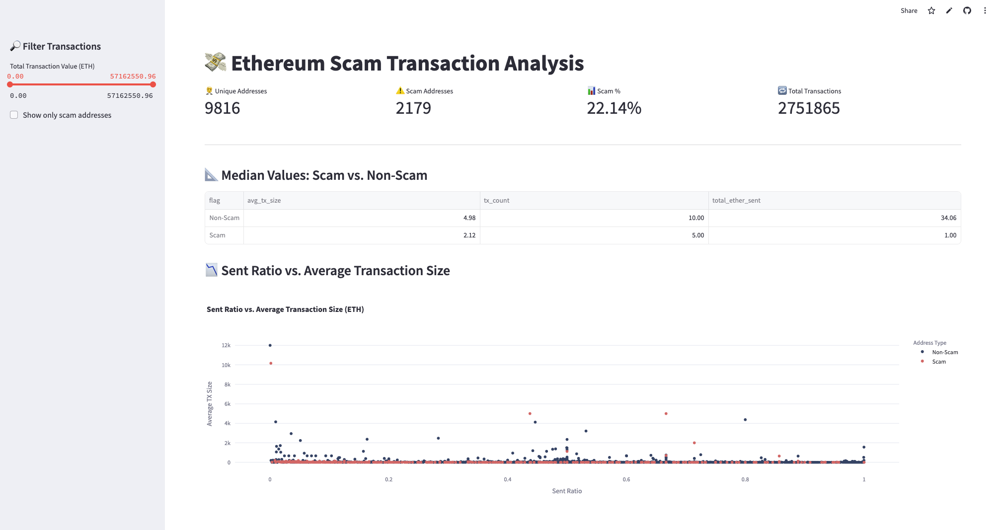
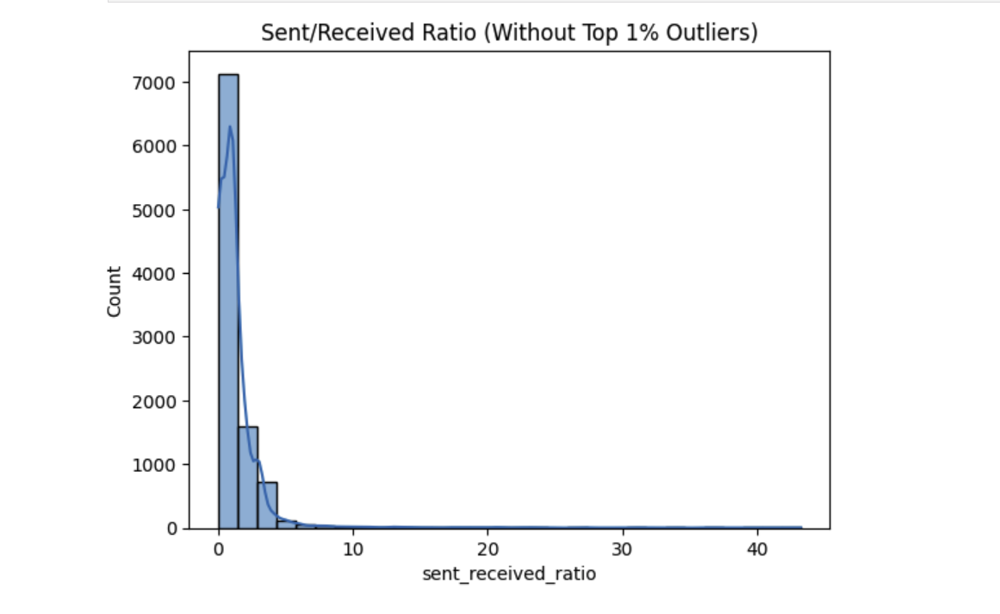
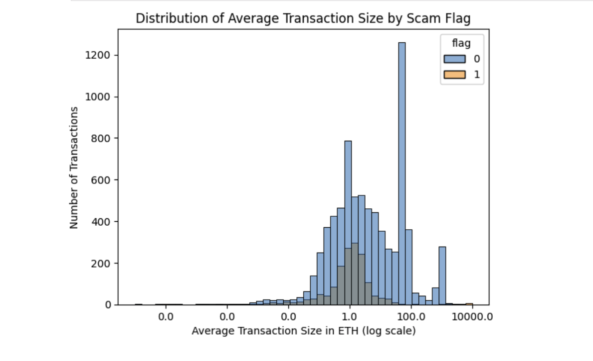

# Analysing Scam Patterns in Ethereum Transactions


## Overview
This project explores transaction patterns on the Ethereum blockchain to identify and analyse scam-related behaviours. Using a combination of data analytics techniques and interactive dashboards, it aims to highlight distinguishing features between scam and non-scam addresses, and to provide actionable insights for the crypto community.

The initial goal was to use up-to-date and reliable scam address data via the Etherscan API. However, due to the lack of accessible, recent, and labeled scam address data through public APIs, the project pivoted to using curated Kaggle dataset. 

## Project Structure
```
Ethereum-Scam-Pattern-Analysis/               
├── Data/                          # Raw and processed datasets
│   ├── raw/
│   └── clean/
│   └── features/
├── Dashboard/                     # Interactive Visualisation app
├── Images/                        # Images used
├── Notebooks/                     # Jupyter notebooks for analysis
│   └── etherscan_api_demo.ipynb
│   └── initial_check.ipynb
│   └── feature_engineering.ipynb
│   └── analysis.ipynb
├── Scripts/                       # Python scripts for data collection and processing
├── README.md                      # Project documentation
└── requirements.txt               # Python dependencies
└── app.py
```

## Objectives
- **Initial Approach: API-Based Data Collection**
  - Attempted to gather scam addresses and transaction data using public APIs (e.g., Etherscan).
  - Intended workflow:
    - Fetch scam addresses from blacklists.
    - Check activity and transaction data via API calls.

- **Analysis Goals**
  - Explore and visualise transaction patterns.
  - Identify features indicative of fraudulent or suspicious activity.
  - Lay the groundwork for future compliance or scam-detection models.


## Key Features
- **_Data Cleaning & Exploration_:** Jupyter notebooks for initial data checks and feature engineering.
- **_Interactive Dashboard_:** Streamlit app for visualising scam vs. non-scam transaction patterns.
- **_Custom Visualisations_**: Includes bar charts, histograms, behavioral segmentation, and more.
- **_API Integration_:** Demonstrates fetching live data from the Etherscan API.

## Screenshots of the Analysis

Streamlit Dashboard Snapshot



<br>

Eliminating Outliers in Jupyter Notebook



<br>

Checking Wallet Distribution in Jupyter Notebook



## Tasks 
 * Data Collection (download and validate datasets, pull additional data using Etherscan API, obtain and integrate scam address lists)
 * Data Cleaning & Preparation
 * Exploratory Data Analysis (EDA)
 * Visualization of Transaction Patterns
 * Initial Scam/Fraud Detection Logic
 * Reporting & Documentation

## Challenges & Lessons Learned
**Data Sourcing Difficulties:**
 * Most public scam address lists are outdated and not recently active.
 * Obtaining recent, labeled scam data through APIs proved difficult; APIs often have strict rate limits and can return incomplete data, making large-scale analysis challenging.

**Pivot to Kaggle Datasets:**
 * To address these issues, I adopted curated, labeled, and often more recent scam address datasets from Kaggle.
 * Kaggle datasets provided transaction-level details, were easier to work with offline, and were not subject to API rate limits or data incompleteness.
 * This pivot enabled more robust exploration as the data was more reliable than what could be obtained from public lists or direct API calls.

**Data Quality & Imbalance:**
 * The datasets are highly imbalanced, with far fewer scam transactions than legitimate ones, requiring careful preprocessing and consideration in analysis.
 * Addressed missing values, zeros, and outliers to ensure meaningful feature engineering.

**Visualisation Issues:**
 * Some charts in Streamlit (especially those using log scales or visualising skewed data) were difficult to interpret due to data distribution (many zeros or extreme outliers).
 * Required creative alternatives and filtering to present clear, actionable insights.

**Dependency & Code Management:**
 * Streamlined requirements.txt to include only essential packages, reducing errors and simplifying collaboration.
 * Cleaned up unused imports and dependencies for a smoother workflow.

## Data Sources
- **Kaggle Ethereum Datasets:** For historical transactions and labeled fraud data.
- **Etherscan API:** Used for supplementary live and historical transaction data (where possible).
- **Public Scam Address Lists:** (e.g., EtherScamDB, EthScamCheck) for reference and cross-validation.

*Powered by Etherscan.io APIs and Kaggle datasets.*

## Getting Started
1. Clone this repository:

   ```git clone `https://github.com/InsightsByIvy/Analysing-Scam-Patterns-in-Ethereum-Transactions```

2. Install dependencies:
   Run `pip install -r requirements.txt` to install dependencies.


## Notes

This project is a work in progress and will be updated as new features are added.

Live Demo
👉 View the Streamlit Dashboard [Here](https://analysing-scam-patterns-in-ethereum-transactions.streamlit.app/)

For educational and demonstration purposes only.

[Back to top](#analysing-scam-patterns-in-ethereum-transactions)
